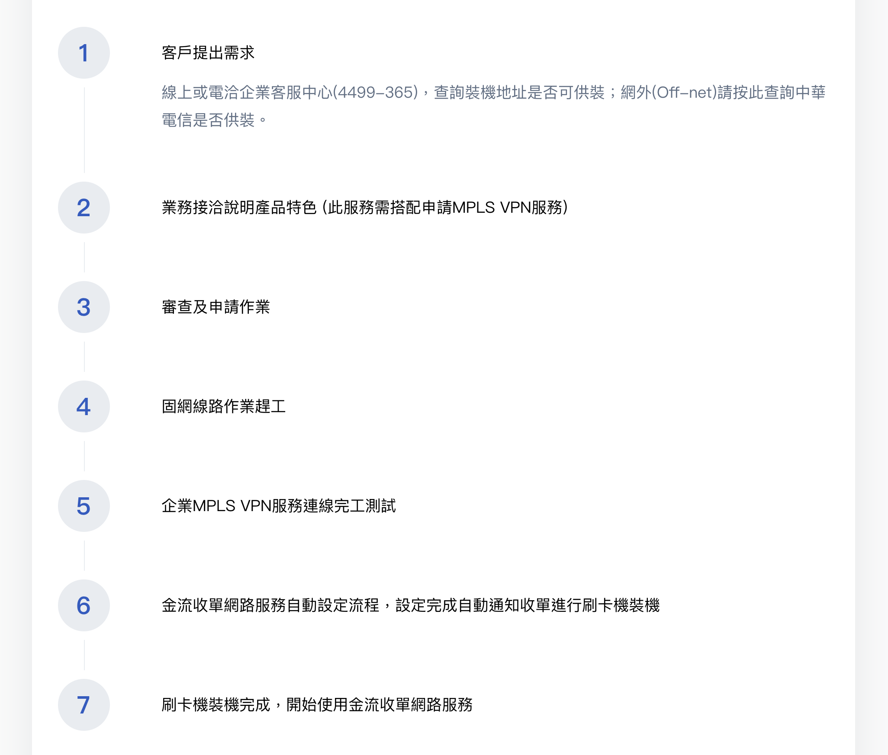

# Timeline



# Usage
```jsx
import Panel from '../../components/panel/Panel';
import Timeline from '../../components/panelContent/Timeline';

const timeline = [
  {
    title: '2011',
    content: '以「Count on Me」系列廣告，訴求遠傳提供多樣化產品及服務，讓人生更豐富',
  },
  {
    title: '2012',
    content: '透過形象廣告強調遠傳服務客戶的精神，與致力追求網路品質的態度',
  },
  ...
];

class Page extends React.Component {
  render() {
    return (
      <Panel>
        <Timeline
          list={timeline}
        />
      </Panel>
    )
  }
}
```

# Source
```jsx
import React from 'react';
import PropTypes from 'prop-types';

class Timeline extends React.Component {
  constructor(props) {
    super(props);
    this.state = {};
  }

  render() {
    return (
      <div className='fui-timeline-container'>
        {this.props.list.map((timeline, i) => (
          <div className='fui-timeline-year' key={`fui-timeline-year-${i}`}>
            <div className='year'>{timeline.title}</div>
            <div className='fui-timeline-year-content' dangerouslySetInnerHTML={{ __html: timeline.content }}></div>
          </div>
        ))}
      </div>
    );
  }
}

Timeline.propTypes = {
  list: PropTypes.array,
};

export default Timeline;
```

## Properties
| 名稱 |  屬性 | 必填 | 選項 | 說明 |
| :--- | :--- | :--- | :--- | :--- |
| list | Array | true |  | **title:** 標題<br>**content:** 內容 |