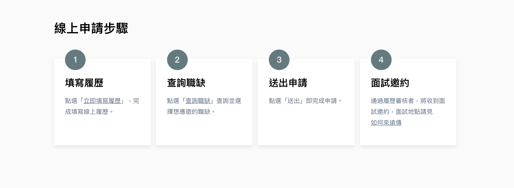

# CardMultiSteps

CardMultiStep 可單獨使用，也可放在 Panel 裡。



## Usage
```jsx
import CardMultiSteps from '../../components/card/CardMultiSteps';

const MultiStep = {
  title: '線上申請步驟',
  list: [
    {
      name: '填寫履歷',
      content: `點選「<a href='#' target='_blank'>立即填寫履歷</a>」，完成填寫線上履歷。`,
    },
    {
      name: '查詢職缺',
      content: `點選「<a href='#' target='_blank'>查詢職缺</a>」查詢並選擇想應徵的職缺。`,
    },
    {
      name: '送出申請',
      content: `點選「送出」即完成申請。`,
    },
    {
      name: '面試邀約',
      content: `通過履歷審核者，將收到面試邀約，面試地點請見<a href='#' target='_blank'>如何來遠傳</a>`,
    },
  ]
}
class Page extends React.Component {
  render() {
    return (
      <CardMultiSteps
        {...MultiStep}
      />
    )
  }
}
```

## Source
```jsx
import React, { Component } from 'react';
import LoadMore from '../LoadMore';
import { Grid } from '@material-ui/core';
import PropTypes from 'prop-types';
class CardMultiSteps extends Component {
  constructor(props) {
    super(props);
    this.state = {};
  }
  getColumns = () => {
    let length = this.props.list.length;
    if (length < 5) {
      return 12 / length;
    } else {
      return 3;
    }
  };
  loadMore = () => {
    // call API 取得更多影片，透過 props 傳回新的 card
    if (this.props.loadMore) this.props.loadMore(this.state.currentPage);
  };
  render() {
    return (
      <section
        className='promotion-card card-multi-step pb-md-10 pb-6 pt-1'
        style={!!this.props.bg ? { backgroundImage: `url(${this.props.bg})` } : null}>
        <div className='fui-container mt-md-4 mt-0 pt-2 '>
          <h2 className='mt-0 mb-8'>{this.props.title}</h2>
          <Grid container spacing={2}>
            {this.props.list.map((item, i) => {
              return (
                <Grid
                  key={item.name + i}
                  className='mb-md-6 mb-3'
                  item
                  xs={12}
                  sm={12}
                  md={6}
                  lg={this.props.column || this.getColumns()}>
                  <div
                    style={{ backgroundImage: `url(${item.bg})` }}
                    className='fui-card is-card-program d-flex flex-column pt-md-6 pt-4 pb-md-4 pb-0 px-md-4 px-2 is-bg-white align-left'>
                    <div className='circle'>{i + 1}</div>
                    {item.name ? (
                      <div>
                        <h3 className='m-0'>{item.name}</h3>
                        <p
                          className='is-text-darkgray50 mt-md-2 mt-1 body'
                          dangerouslySetInnerHTML={{ __html: item.content }}></p>
                      </div>
                    ) : (
                      <p
                        className='is-text-darkgray50 mt-0 body'
                        dangerouslySetInnerHTML={{ __html: item.content }}></p>
                    )}
                  </div>
                </Grid>
              );
            })}
          </Grid>
          {this.props.hasMore ? (
            <LoadMore
              moreLabel='展開看更多'
              className='mt-2 mb-0'
              noMoreLabel='已經沒有更多內容囉！'
              click={() => this.props.loadMore()}
              load={this.props.hasMore}
            />
          ) : null}
        </div>
      </section>
    );
  }
}

CardMultiSteps.propTypes = {
  title: PropTypes.string,
  hasMore: PropTypes.bool,
  column: PropTypes.number,
  list: PropTypes.arrayOf(
    PropTypes.shape({
      name: PropTypes.string,
      content: PropTypes.string,
    })
  ),
  bg: PropTypes.string,
  loadMore: PropTypes.func,
};
export default CardMultiSteps;
```

## Properties
| 名稱 |  屬性 | 必填 | 選項 | 說明 |
| :--- | :--- | :--- | :--- | :--- |
| title | String | true |  | 標題 |
| list | Array | true |  | 標題 |
| hasMore | Boolean |  |  | 是否有更多牌卡，預設為 false |
| column | Number |  |  | 一列顯示的牌卡數，若沒有設定由模組行計算 |
| bg | String |  |  | 背景圖 |
| loadMore | Function |  |  | 讀取更多內容 |