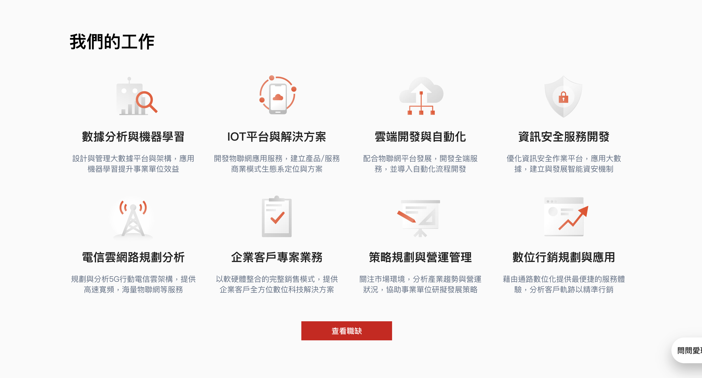

# CorpFeatureList



## Usage
```jsx
import CorpFeatureList from '../../components/partials/CorpFeatureList';

const featurList = {
  title: '我們的工作',
  list: [
    {
      link: '/',
      target: '_blank',
      image: '/resources/corp/images/feature-1.jpg',
      title: '數據分析與機器學習',
      description: '設計與管理大數據平台與架構，應用機器學習提升事業單位效益',
    },
    ...
  ],
  action: {
    text: '查看職缺',
    link: '/',
    target: '_blank',
  }
}

class Page extends React.Component {
  render() {
    return (
      <CorpFeatureList
        {...featurList}
      />
    )
  }
}
```

## Source
```jsx
import React from 'react';
import { Grid } from '@material-ui/core';
import Link from '../Link';
import Button from '../Button';
import PropTypes from 'prop-types';

class CorpFeatureList extends React.Component {
  render() {
    return (
      <section className='fui-feature-list'>
        <div className='fui-container'>
          <h2>{this.props.title}</h2>
          <Grid container spacing={4} className='mb-5'>
            {this.props.list.map((item, i) => (
              <Grid item xs={12} sm={6} md={3} className='align-center px-6 px-md-2' key={`fui-feature-list-${i}`}>
                <Link to={item.link} target={item.target}>
                  
                  <h4 className='mb-2'>{item.title}</h4>
                  <div className='is-text-darkgray50'>{item.description}</div>
                </Link>
              </Grid>
            ))}
          </Grid>
          {this.props.action ? (
            <div className='page-action mt-5 align-center'>
              <Button to={this.props.action.link} target={this.props.action.target} btnStyle='primary'>
                {this.props.action.text}
              </Button>
            </div>
          ) : null}
        </div>
      </section>
    );
  }
}

CorpFeatureList.propTypes = {
  title: PropTypes.string,
  list: PropTypes.arrayOf(
    PropTypes.shape({
      image: PropTypes.string,
      title: PropTypes.string,
      description: PropTypes.string,
    })
  ),
  action: PropTypes.shape({
    text: PropTypes.string,
    link: PropTypes.string,
  }),
};

export default CorpFeatureList;
```

## Properties
| 名稱 |  屬性 | 必填 | 選項 | 說明 |
| :--- | :--- | :--- | :--- | :--- |
| title | String | true |  | 標題 |
| list | Array | true |  | **image:** 圖片<br>**title:** 小標<br>**description:** 描述 |
| action | Object | true |  | **text:** 連結文字<br>**link:** 連結 |