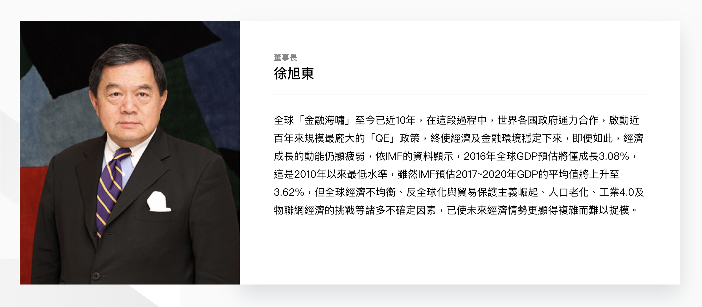
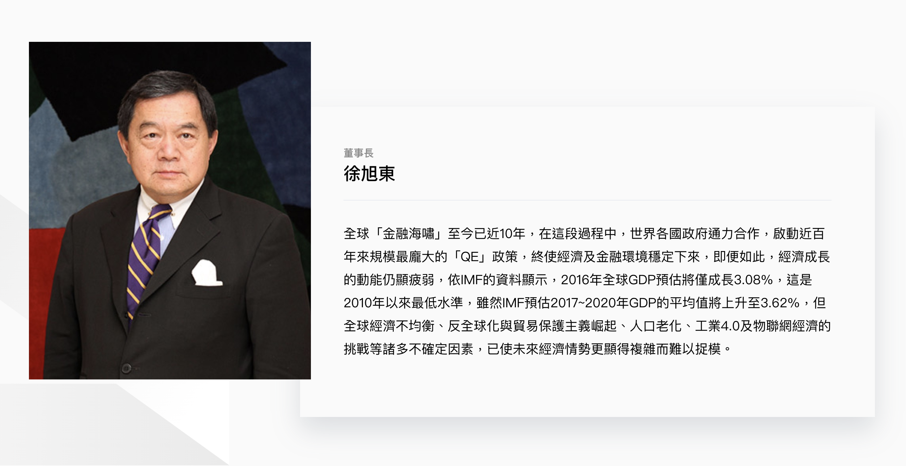

# CorpLayout

**inContent = true**


**inContent = false**


### Usage 
```jsx

import CorpLayout from '../../components/CorpLayout';

class Page extends React.Component {
  render () {
    return (
      <section>
        <div className='fui-container'>
          <CorpLayout
            inContent={true}
            image={'/resources/corp/images/img-douglas-hsu@2x.jpg'}
            meta='董事長'
            title='徐旭東'
            description='全球「金融海嘯」至今已近10年，在這段過程中，世界各國政府通力合作，啟動近百年來規模最龐大的「QE」政策，終使經濟及金融環境穩定下來，即便如此，經濟成長的動能仍顯疲弱，依IMF的資料顯示，2016年全球GDP預估將僅成長3.08%，這是2010年以來最低水準，雖然IMF預估2017~2020年GDP的平均值將上升至3.62%，但全球經濟不均衡、反全球化與貿易保護主義崛起、人口老化、工業4.0及物聯網經濟的挑戰等諸多不確定因素，已使未來經濟情勢更顯得複雜而難以捉模。'
            action={{ text: '看更多', link: '' }}
          />
        </div>
      </section>
    )
  }
}
```

### Source
```jsx
import React from 'react';
import { Grid } from '@material-ui/core';
import Link from './Link';
import ArrowLeftWhite from './animateArrow/ArrowLeftWhite';
import ArrowRightWhite from './animateArrow/ArrowRightWhite';

import PropTypes from 'prop-types';

class CorpLayout extends React.Component {
  constructor(props) {
    super(props);

    this.state = {
      inContent: this.props.inContent || false,
      isEn: typeof window !== 'undefined' && window.$isEn,
    };
  }
  render() {
    return (
      <div
        className={`fui-corp-layout ${this.props.inContent ? 'is-in-content' : ''} ${
          this.props.layoutReverse ? 'is-reverse-layout' : ''
        }`}>
        {this.props.layoutReverse ? <ArrowRightWhite /> : <ArrowLeftWhite />}
        <Grid container>
          <Grid xs={12} sm={4} md={4}>
            <div className='image'>
              
            </div>
          </Grid>
          <Grid xs={12} sm={8} md={8}>
            <div className='content'>
              <div className='fui-card'>
                {this.props.inContent ? (
                  <div className='fui-card-content'>
                    <h5 className='fui-card-meta is-text-gray100'>{this.props.meta}</h5>
                    <h2 className='fui-card-title'>{this.props.title}</h2>
                    <hr />
                    <div
                      className='description body'
                      dangerouslySetInnerHTML={{ __html: this.props.description }}></div>
                  </div>
                ) : (
                  <Link to={this.props.action.link} className='fui-card-action'>
                    <div className='fui-card-content'>
                      <h5 className='fui-card-meta is-text-gray100'>{this.props.meta}</h5>
                      <h2 className='fui-card-title'>{this.props.title}</h2>
                      <hr />
                      <div
                        className='description body'
                        dangerouslySetInnerHTML={{ __html: this.props.description }}></div>
                      {this.props.action ? (
                        <div className={`fui-button is-${this.props.action.btnStyle || 'arrow'} mb-0`}>
                          <span className='text'>
                            {this.props.action.text ? this.props.action.text : this.state.isEn ? 'more' : '看更多'}
                          </span>
                          {this.props.action.icon ? this.props.action.icon : null}
                        </div>
                      ) : null}
                    </div>
                  </Link>
                )}
              </div>
            </div>
          </Grid>
        </Grid>
      </div>
    );
  }
}

CorpLayout.propTypes = {
  inContent: PropTypes.bool,
  layoutReverse: PropTypes.bool,
  image: PropTypes.string,
  meta: PropTypes.string,
  title: PropTypes.string,
  description: PropTypes.string,
  action: PropTypes.shape({
    link: PropTypes.string,
    text: PropTypes.string,
  }),
};

export default CorpLayout;
```

## Properties
| 名稱 | 屬性 | 必填 | 選項 | 說明 |
| :--- | :--- | :--- | :--- | :--- |
| inContent | Boolean |  |  | 圖文排版是否交錯呈現 |
| layoutReverse | Boolean |  |  | 是否要左文右圖排列，預設為左圖右文 |
| image | String | true |  | 圖片 |
| meta | String | true |  | 標題上方小字 |
| title | String | true |  | 標題 |
| description | String | true |  | 描述 |
| action | Object | true |  | **link:** 連結<br/>**text:** 連結文字 |