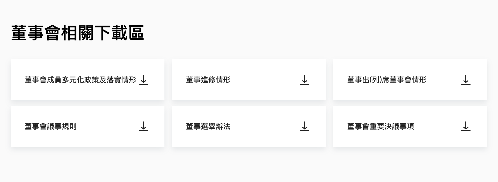

# Downloads



## Usage
```jsx
import Downloads from '../../components/Downloads';

const Downloads = [
  {
    type: 'download',
    title: '董事會成員多元化政策及落實情形',
    link:
      'https://www.fetnet.net/corporate/documents/tc/Diversity%20of%20Board%20Members%20Policy%20and%20Implementation(CH).pdf',
    target: '_blank',
  },
  ...
];

class Page extends React.Componetn {
  render() {
    return (
      <section>
        <div className='fui-container'>
          <Downloads
            title='董事會相關下載區'
            downloads={Downloads}
          />
        </div>
      </section>
    )
  }
}
```

## Source

```jsx
import React from 'react';
import { Grid } from '@material-ui/core';
import Link from './Link';
import PropTypes from 'prop-types';

class Downloads extends React.Component {
  render() {
    return (
      <section>
        <div className='fui-container'>
          <h2>{this.props.title}</h2>
          <Grid container className='fui-download-item paper-links' spacing={2}>
            {this.props.downloads.map((download, i) => (
              <Grid item xs={12} sm={6} md={4} key={`download-item-${i}`}>
                <Link to={download.link} target={download.target} className={`paper-link ${download.type}`}>
                  <div className='text is-text-medium'>{download.title}</div>
                </Link>
              </Grid>
            ))}
          </Grid>
        </div>
      </section>
    );
  }
}

Downloads.propTypes = {
  title: PropTypes.string,
  downloads: PropTypes.arrayOf(
    PropTypes.shape({
      type: PropTypes.string,
      title: PropTypes.string,
      link: PropTypes.string,
      target: PropTypes.string,
    })
  ),
};

export default Downloads;
```

## Properties
| 名稱 | 屬性 | 必填 | 選項 | 說明 |
| :--- | :--- | :--- | :--- | :--- |
| title | String | true |  | 標題 |
| downloads | Array | true |  | **type:** 連結類型，搭配不同 icon。這裏都使用 'download'<br/>**title:** 下載檔名<br/>**link:** 下載連結<br/>**target:** _self or _blank 跳轉頁面或另開視窗 |
