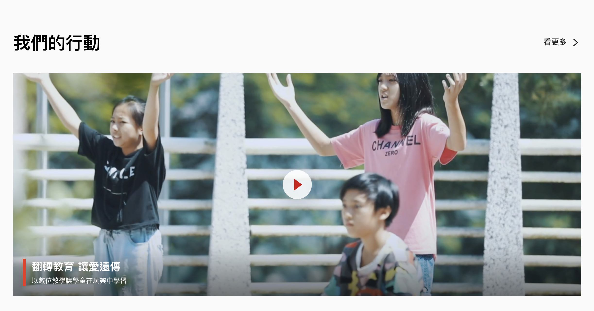

# SingleVideoWithCaption



### Usage
```jsx
import SingleVideoWithCaption from '../components/SingleVideoWithCaption';

const CorpVideo = {
  title: '我們的行動',
  videoId: 'l1SOqnVP-W0',
  videoLink: 'https://www.youtube.com/watch?v=l1SOqnVP-W0',
  imgLarge: '/resources/corp/images/video-bg-desktop.png',
  imgSmall: '/resources/corp/images/video-bg-mobile.png',
  caption: {
    title: '翻轉教育 讓愛遠傳',
    description: '以數位教學讓學童在玩樂中學習',
  },
  more: {
    text: '看更多',
    link: '',
  },
};

class Page extends React.Component {
  render () {
    return (
      <SingleVideoWithCaption {...CorpVideo} />
    )
  }
}
```

### Source
```jsx
import React, { Component } from 'react';
import VideoModal from './VideoModal';
import PropTypes from 'prop-types';
class SingleVideoWithCaption extends Component {
  constructor(props) {
    super(props);
    this.VideoSlideSetting = {
      dots: false,
      infinite: false,
      arrows: true,
      slidesToShow: 1,
      draggable: true,
    };
    this.state = {
      currentVideo: '',
      modalOpen: false,
    };
  }
  openVideoModal = (data) => {
    this.setState({
      modalOpen: true,
      alterVideo: data.alterVideo ? data.alterVideo : null,
      currentVideo: data.videoId,
    });
  };

  closeModal = () => {
    this.setState({
      modalOpen: false,
      alterVideo: '',
      currentVideo: '',
    });
  };
  render() {
    return (
      <section className='fui-horzonal-cards video-carousel is-narrow p-0'>
        <div className='fui-container'>
          <div className='fui-section-header'>
            <h2 className='section-title m-0 mb-0 p-0'>{this.props.title}</h2>
            {this.props.more ? (
              <a href={this.props.more.link} className='fui-button is-text pr-0'>
                {this.props.more.text}
                <i className='icon-chevron-right'></i>
              </a>
            ) : (
              ''
            )}
          </div>
          <div
            style={{ zIndex: 1 }}
            className='video-card'
            data-fet-key={this.props.fetKey || ''}
            onClick={() => this.openVideoModal(this.props)}>
            <div className='video-img d-none d-sm-block' style={{ backgroundImage: `url(${this.props.imgLarge})` }} />
            <div className='video-img d-block d-sm-none' style={{ backgroundImage: `url(${this.props.imgSmall})` }} />
            <div className='mask'></div>
            {this.props.caption ? (
              <div className='caption'>
                <div className='heading-5'>{this.props.caption.title}</div>
                <div className='text-sm'>{this.props.caption.description}</div>
              </div>
            ) : null}
          </div>
        </div>
        <VideoModal
          open={this.state.modalOpen}
          alterVideo={this.state.alterVideo}
          videoUrl={this.state.currentVideo}
          onClose={this.closeModal}
        />
      </section>
    );
  }
}

SingleVideoWithCaption.propTypes = {
  title: PropTypes.string,
  videoId: PropTypes.string,
  imgLarge: PropTypes.string,
  imgSmall: PropTypes.string,
  videoLink: PropTypes.string,
  alterVideo: PropTypes.string,
  caption: PropTypes.shape({
    title: PropTypes.string,
    description: PropTypes.string,
  }),
};
export default SingleVideoWithCaption;
```

### Properties
| 名稱 | 屬性 | 必填 | 選項 | 說明 |
| :--- | :--- | :--- | :--- | :--- |
| title | String |  |  | 區塊標題 |
| videoId | String |  |  | Youtube videoId |
| imgLarge | String |  |  | 影片大網封面 |
| imgSmall | String |  |  | 影片小網封面 |
| alterVideo | String |  |  | 影片連結 |
| caption | Object |  |  | **title:** 影片標題<br/>**description:** 影片描述 |
